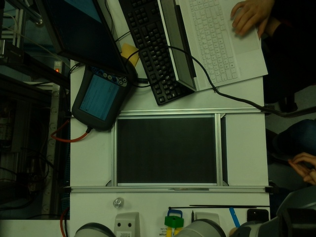

# Readme: Projet ROBVIS

## Tutoriel

Pour utiliser notre programme, il faut tout d'abord enregistrer des images des formes pour le template matching avec le programme *rec_temp.py*. Ensuite on peut lancer le programme *template_match.py* pour obtenir les variables à envoyer au robot. Enfin, on utilise le programme *socket.py* pour envoyer les variables sur RobotStudio. 

## Détails sur la démarche

    
    

Notre projet était d'établir une connection entre le robot YuMi de ABB et une caméra de profondeur. Il peut se hiérarchiser en différentes étapes:
1. Acquisition de l'image
2. Traitement de l'image
3. Communication des informations à RobotStudio
4. Actionnement du robot

### Acquisition de l'image

Nous avons fixé une caméra Intel au dessus du robot Yumi, nous permettant de capturer des images en vue du dessus des objets.

*Je ne sais pas quoi mettre comme explication après* 

### Traitement de l'image

Une fois l'image traité, on peut récupérer tout d'abord le centre de gravité $(\bar{x},\bar{y})$ des formes. Ceci nous permet de trouver leur position en $mm$ dans le repère de la caméra. 

Comme les plans de la caméra et d'intéraction (celui où les objets sont disposés) sont parallèle. Ceci permet d'établir une relation linéaire entre les coordonnées des objets dans le repère de la caméra et le repère du robot. 

**Changement de repère**
$$  \begin{bmatrix} x' \\ y' \\ z' \\ 1 \end{bmatrix} = \begin{bmatrix} a & b & c & t_x \\ d & e & f & t_y \\ g & h & i & t_z \\ 0 & 0 & 0 & 1 \end{bmatrix} \begin{bmatrix} x \\ y \\ z \\ 1 \end{bmatrix}$$
Où :

- $(x, y, z)$ sont les coordonnées du point source,
- $(x', y', z')$ sont les coordonnées du point transformé (destination),
- $(a, b, c, d, e, f, g, h, i)$ sont les coefficients de la transformation affine,
- $(t_x, t_y, t_z)$ sont les composantes de la translation dans les directions $x, y$ et $z$ respectivement.

Dans ce contexte, la matrice 
$$ \begin{bmatrix} a & b & c & t_x \\ d & e & f & t_y \\ g & h & i & t_z \\ 0 & 0 & 0 & 1 \end{bmatrix}$$  
est dite de transformation affine où les coefficients de cette matrice correspondent aux paramètres de la transformation affine. On trouve cette matrice en faisant une résolution linéaire en choisissant 4 points dont on connait les coordonnées dans les deux repères. On trouve enfin les coordonées de l'objet dans le repère du robot.

Ensuite, on calcul l'orientation de l'objet. Pour ce faire on prend les coordonées $(x_i,y_i)$ de chaque pixel. On calcule
 $$\bar{x}_i = \bar{x} - x_i$$
  $$\bar{y}_i = \bar{y} - y_i$$

On crée alors une matrice C tel que

$$ C = M^TM $$

Où $$ M^T = \begin{bmatrix} \bar{x}_1 & \bar{x}_2 & \cdots & \bar{x}_n \\ \bar{y}_1 & \bar{y}_2 & \cdots & \bar{y}_n  \end{bmatrix}$$

On extrait le vecteur propre associé à la valeur propre maximale de la matrice C ce qui correspond à l'orientation de l'objet. On convertit ce vecteur en quaternion. 

### Communication des informations à RobotStudio

Nous communiquons avec RobotStudio par protocole TCP/IP, nous communiquons, les coordonées $(x,y,z)$ de la forme, un quaternion et si l'objet est à l'endroit ou à l'envers. Les variables sont acquises par le programme Robot_R_Harm

### Actionnement du robot

On utilise alors les variables acquises pour lancer le programme sur le bras droit.  
